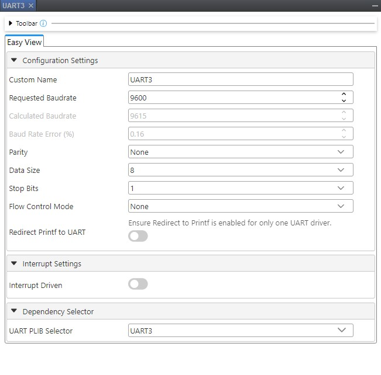

<!-- Please do not change this html logo with link -->

# Direct Memory Access (DMA) on PIC MCUs [Part two] - UART to PWM

This is part 2 of 2 of an example showing how to set up DMA using the Microchip Code Configurator (MCC) to transfer data from the devices Universal Asynchronous Receiver Transmitter (UART) recieve buffer to the Pulse-Width Modulation (PWM) duty cycle register to alter the brightness of an LED based on the incoming serial messages from the device set up in part 1. The data transfer is triggered directly by the hardware UART module when the Rx buffer register is full, meaning we achieve this with zero CPU utilization.

<!-- This is where the introduction to the example goes, including mentioning the peripherals used -->
| Peripherals Used                                              |
|---------------------------------------------------------------|
| Analog-to-Digital Converter (ADC)                             |
| Direct Memory Access (DMA)                                    |
| Pulse-Width Modulation (PWM)                                  |
| Universal Synchronous Asynchronous Serial Transmitter (USART) |

## Related Documentation

- [TB3242: Configuring the DMA Peripheral](https://ww1.microchip.com/downloads/en/Appnotes/90003242A.pdf?utm_campaign=PIC18FQ43&utm_source=GitHub&utm_medium=hyperlink&utm_term=&utm_content=pic18f57q43-dma-uart-to-pwm-part2-MCU8_MMTCha)
- [TB3164: Direct Memory Access on 8-bit PIC® Microcontrollers](http://ww1.microchip.com/downloads/en/AppNotes/TB3164-Direct%20Memory-Access-on-8-bit-PIC-MCU-DS90003164B.pdf?utm_campaign=PIC18FQ43&utm_source=GitHub&utm_medium=hyperlink&utm_term=&utm_content=pic18f57q43-dma-uart-to-pwm-part2-MCU8_MMTCha)
- [AN3312: Arbitrary Waveform Generator Using DAC and DMA](https://www.microchip.com/00003312)
- [AN3382: ADCC Context Switching Using DMA](https://microchip.com/00003382)
- [AN3398: Building Hardware State Machines with CIPs](https://www.microchip.com/00003398)

## Software Used

All software used in this example is listed here:
- [MPLAB® X IDE 6.20](https://www.microchip.com/mplab/mplab-x-ide?utm_campaign=PIC18FQ43&utm_source=GitHub&utm_medium=hyperlink&utm_term=&utm_content=pic18f57q43-dma-uart-to-pwm-part2-MCU8_MMTCha) or newer
- [MPLAB® XC8 3.00 compiler](https://www.microchip.com/mplab/compilers?utm_campaign=PIC18FQ43&utm_source=GitHub&utm_medium=hyperlink&utm_term=&utm_content=pic18f57q43-dma-uart-to-pwm-part2-MCU8_MMTCha) or newer
- [MPLAB® Code Configurator (MCC) 5.7.1](https://www.microchip.com/mplab/mplab-code-configurator?utm_campaign=PIC18FQ43&utm_source=GitHub&utm_medium=hyperlink&utm_term=&utm_content=pic18f57q43-dma-uart-to-pwm-part2-MCU8_MMTCha) or newer
  - [MCC Device Libraries PIC10 / PIC12 / PIC16 / PIC18 MCUs](https://www.microchip.com/mplab/mplab-code-configurator?utm_campaign=PIC18FQ43&utm_source=GitHub&utm_medium=hyperlink&utm_term=&utm_content=pic18f57q43-dma-uart-to-pwm-part2-MCU8_MMTCha)
- [Microchip PIC18F-Q Series Device Support (1.26.442)](https://www.microchip.com/mplab/mplab-code-configurator?utm_campaign=PIC18FQ43&utm_source=GitHub&utm_medium=hyperlink&utm_term=&utm_content=pic18f57q43-dma-uart-to-pwm-part2-MCU8_MMTCha) or newer

## Hardware Used
- PIC18F57Q43 Curiosity Nano [(DM164150)](https://www.microchip.com/Developmenttools/ProductDetails/DM164150?utm_campaign=PIC18FQ43&utm_source=GitHub&utm_medium=hyperlink&utm_term=&utm_content=pic18f57q43-dma-uart-to-pwm-part2-MCU8_MMTCha)
  - **Note:** There is a second device used in [part 1](https://github.com/microchip-pic-avr-examples/pic18f57q43-dma-adc-to-uart-part1)
- Potentiometer (x1) - used in [part 1](https://github.com/microchip-pic-avr-examples/pic18f57q43-dma-adc-to-uart-part1)
- [Optional] Curiosity Nano Base for Click boards™ [(AC164162)](https://www.microchip.com/Developmenttools/ProductDetails/AC164162?utm_campaign=PIC18FQ43&utm_source=GitHub&utm_medium=hyperlink&utm_term=&utm_content=pic18f57q43-dma-uart-to-pwm-part2-MCU8_MMTCha) - this was used in lieu of a breadboard

## Setup

The hardware is setup as shown in more detail in [**this video**](https://www.youtube.com/watch?v=Wz7gt11gpSw). Below is a diagram of the specific pins used. The Curiosity Nano Baseboard for clicks is missing from this diagram as they were only used as alternative to a breadboard in this case.

| Potentiometer | Q43 (part 1)      |               | Q43 (part 2)|
|---------------|-------------------|---------------|-------------|
|        +      |    3.3V           |               |             |
|       gnd     |    gnd            |               |             |
|   output      |    RA0            | (Yellow Wire) |             |             
|               |    RA3 (UART3 TX) | -----------> |    RA4 (UART3 RX)  |             |

## Operation & Summary

The images below show the operation of the demo.

## Walkthrough

### Create New MPLAB X Project and Open MCC
1. Same as before in [part 1](https://github.com/microchip-pic-avr-examples/pic18f57q43-dma-adc-to-uart-part1), but restated here for clarity.
2. Open the MPLAB X IDE.
3. Create new project by clicking the icon:    
   1. Alternatively: *File>New Project*
4. In the Choose Project window:
   1. Select Microchip Embedded category.
   2. Select Standalone Project.
   3. Click **Next**.
5. In Select Device window:
   1. Select PIC18F57Q43 as your device.
   2. Pro-tip: quickly filter for devices by inputting the last 3-4 characters of the device name and then selecting from the drop-down list (e.g. Q43).
   3.  Click **Next>**.
6.  In Select Tool (optional) window:
    1.  If the device is connected – select Microchip Kits>PIC18F57Q43 Curiosity Nano (PKOB nano).
    2.  If not, you can do this later when programming the device.
    3.  Click **Next>**.
7.  In the Select Compiler window.
    1.  Select XC8 (v3.00).
    2.  Click **Finish**.

### Configure MCC
8. In **Project Resources** under System select **Clock Control**.
9. In **Clock Control** tab, set Clock Source to HFINTOSC.
    1. While this example uses a system clock of 1 MHz, it must be noted that any larger value for the system clock will provide similar results.

10. In **Project Resources** under System select **Configuration Bits**.
    1. In the **Configuration Bits** tab, choose Oscillator not enabled under External Oscillator Selection.
    2. Under **Reset Oscillator Selection** choose "HFINTOSC with HFFRQ = 4 MHz and CDIV = 4:1".

11. Under **Device Resources** left-hand pane:
    1.  Open the Drivers drop-down.
    2.  Double-click PWM1_16BIT under the PWM drop-down to add it to your project.
    3.  Double-click UART3 under the UART drop-down to add it to your project.

12. Click on **UART3** under the **Project Resources** pane. 
    1.  In the **UART** tab, set baud rate to 9600.

13. In the **PWM1_16BIT window** / Easy Setup tab:
    1. Check the Slider next to Enable PWM.
    2. Choose Left aligned mode under the Mode drop-down.      
    3. Set the Requested Frequency to 1 kHz.

14. In the **Pin Manager: Grid View** window, connect pins:
    1. RX3 -> RA4.
    2. PWM -> RF3 (pin tied to CNano board LED0 as per schematic).
    3. Select Pins under the System drop-down in **Project Resources**.
    4. Make sure that the Analog option for RA4 and RF3 is un-checked.

15. Choose **DMA1** under **Device Resources**.
     1. In the **DMA1** tab, select DMA Enable.
     2. Choose the Start Trigger as U3RX.
     3. Turn on Start Trigger Enable.
     4. Choose SFR, UART3, U3RXB for Source Region, Source Module, and Source SFR respectively.
     5. Choose Source Mode as unchanged.
     6. Set Source Message Size to 1.
     7. Choose SFR, PWM1_16BIT, and PWM1S1P1L for Destination Region, Destination Module and Destination SFR respectively.
     8. Set Destination Mode to incremented.
     9. Set Destination Message Size to 2. 

16. Outcome of previous settings:
    1.  UART3 is the data source module of DMA channel 1.
    2.  U3RXB is the Special function register (SFR) region that we want data to be sourced from.
    3.  The U3RXB SFR register is 1-byte, therefore the mode is unchanged since we don’t need to increment over multiple bytes or registers.
    4.  Similarly, the UART RX Buffer is 1-byte, so we need to indicate that the message size is 1-byte.
    5.  PWM1_16bit is the data destination module, with the PWM1S1P1L being the specific destination SFR.
    6.  The PWM period register is 16-bits, meaning we will need to increment in order to load both the low register that we started with and the PWM1S1P1H (high), which also means our message size is two bytes since we are loading two 8-bit registers.
    7.  Set the DMA start trigger to fire every time the RX Buffer is full (U3RX).
    8.  **Note*** we did not need to set VarSize, VarName, and Address parameters as these are only required when working with user-defined values in memory as opposed to fixed SFRs in this case.
17. Click **Generate Project**. 
18. In the `main.c` file that was generated, add the following line of code before `while(1)`:
     
     `PWM1LDS = 0xB;   // PWM1 auto-load trigger source is DMA1_Destination_Count_Done`
    This allows the PWM regsiter to be automatically loaded when the DMA transfer is complete.

19. Click **Program the device** 

## Conclusion
This example showed how to implement some systems coms, automatic memory operations, and waveform generation while only having to write one line of code. The project can be built to accomodate other preferences as well. Find more detailed applications in the documents linked in the [**resource section**](#related-documentation), or check out other code examples in the repo.
